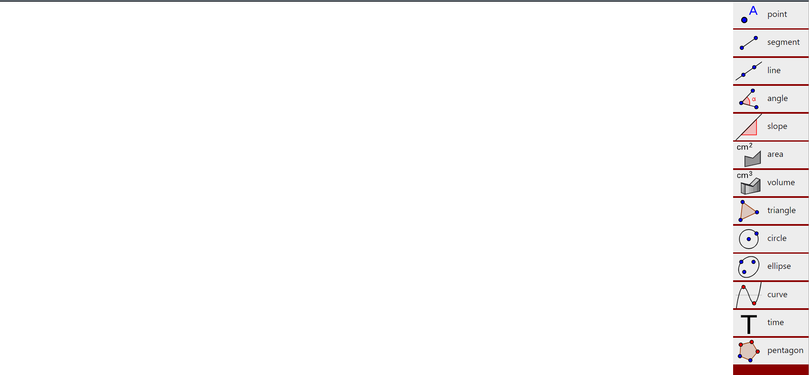

<h1>Little Mathy</h1>
<h2>Like <i>Little Alchemy</i>, but with <strong>Maths</strong></h2>

<h2>Demo</h2>

<h3>Functionalities:</h3>
<ul>
  <li>drag/drop entities</li>
  <li>detect entity collisions</li>
  <li>combine entities</li>
  <li>detect collisions with the menu</li>
</ul>
